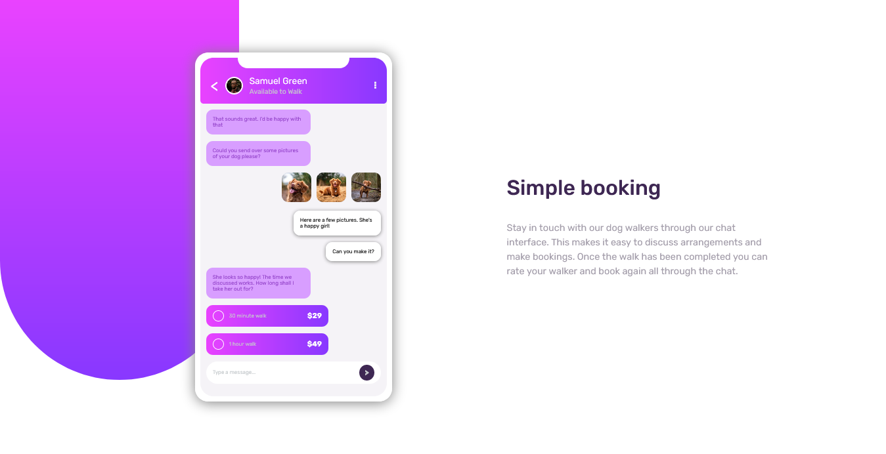

# Frontend Mentor - Chat app CSS illustration solution

This is a solution to the [Chat app CSS illustration challenge on Frontend Mentor](https://www.frontendmentor.io/challenges/chat-app-css-illustration-O5auMkFqY). Frontend Mentor challenges help you improve your coding skills by building realistic projects.

## Table of contents

-   [Overview](#overview)
    -   [The challenge](#the-challenge)
    -   [Screenshot](#screenshot)
    -   [Links](#links)
-   [My process](#my-process)

    -   [Built with](#built-with)
    -   [What I learned](#what-i-learned)

-   [Author](#author)

## Overview

### The challenge

Users should be able to:

-   View the optimal layout for the component depending on their device's screen size
-   **Bonus**: See the chat interface animate on the initial load

### Screenshot

### Links

-   Solution URL: [Solution](https://github.com/ArryBlack/Chat-App-Illustration-with-Vanilla-CSS-)
-   Live Site URL: [Live Site](https://arryblack.github.io/Chat-App-Illustration-with-Vanilla-CSS-/)

## My process

### Built with

-   Semantic HTML5 markup
-   CSS custom properties
-   Flexbox
-   CSS Animations
-   Mobile-first workflow

## Author

-   GitHub - [Arry Black](https://github.com/ArryBlack)
-   Frontend Mentor - [@ArryBlack](https://www.frontendmentor.io/profile/ArryBlack)
